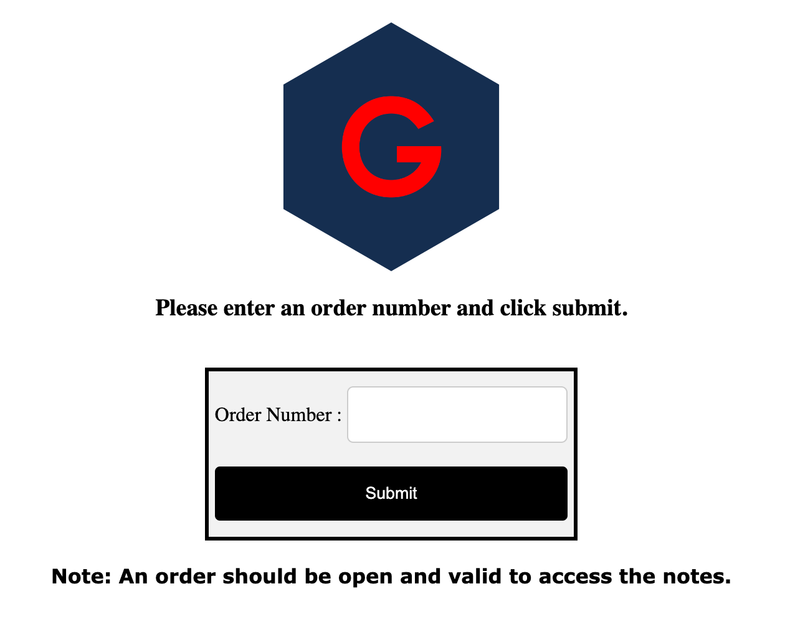
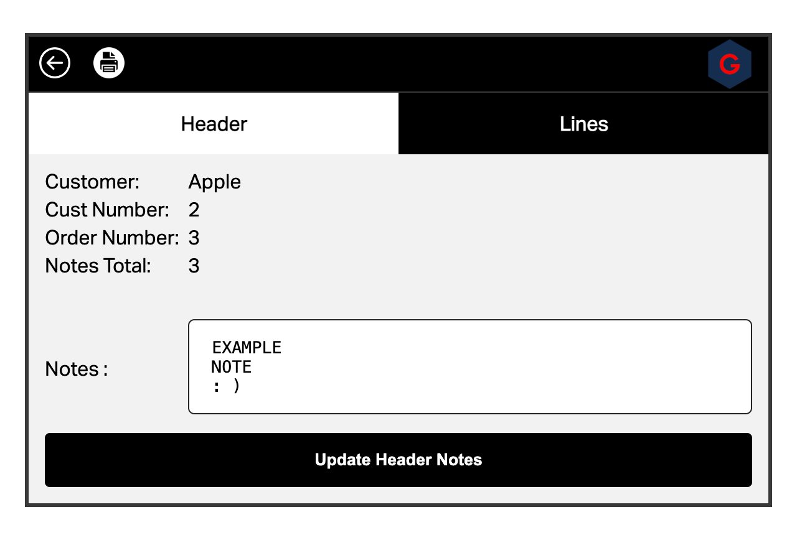
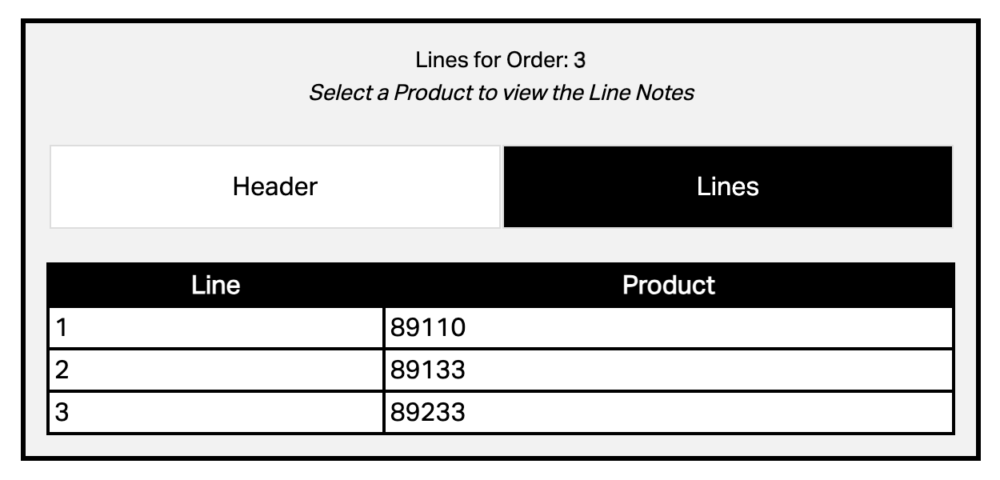

<!-- Begin README -->

    

    
    
    
     
    
    
    
     
    

---------------

<h1 align="center">Order Notes Editor</h1>

This webapp solves a specific problem with ERP applications - the inability to paste multiple lines of text into note fields. It allows users to easily paste and manage multiline text, overcoming the limitations commonly found in ERP systems. This tool focuses on simplicity and efficiency, making it ideal for enhancing data entry and note-taking within enterprise applications. 

Add, edit, and delete order notes in bulk using a `PHP` script and `MySQL` database (or any other database of your choice).

    

 

    

 

    

---------------

## Table of Contents

- [Getting Started](#getting-started)
- [Resources](#resources)
- [License](#license)
- [Credits](#credits)

## Getting Started

> [!TIP]
> By default, the application uses `mysqli` to connect to a `MySQL` database. You can use any database you want by changing the connection method in the `config.php` file (to `odbc`, `pdo`, etc. for example).

This project is designed to be run on a local server. You can use [XAMPP](https://www.apachefriends.org/index.html) to run a local server on your machine.

1. Clone the repository to your local machine.
2. Create a database in MySQL using the `order_notes.sql` file in the `sql` folder.
3. Update the `config.php` file in the `includes` folder with your database credentials.
4. Open the `access.php` file in your browser.
5. Enter a valid order number and click the `Submit` button.
6. Add, edit, or delete notes as needed.
7. Click the `Submit` button to save your changes.
8. Click the `Back` button to return to the order number input screen.
9. Click the `Lines` button to view the order lines for the order number you entered.
10. Add, edit, or delete notes as needed for each order line.

## Resources

- [PHP](https://www.php.net/)
- [MySQL](https://www.mysql.com/)
- [XAMPP](https://www.apachefriends.org/index.html)

## License

This project is released under the terms of the **MIT License**, which permits use, modification, and distribution of the code, subject to the conditions outlined in the license.
- The [MIT License](https://choosealicense.com/licenses/mit/) provides certain freedoms while preserving rights of attribution to the original creators.
- For more details, see the [LICENSE](LICENSE) file in this repository. in this repository.

## Credits

**Author:** [Scott Grivner](https://github.com/scottgriv)  
**Email:** [scott.grivner@gmail.com](mailto:scott.grivner@gmail.com)  
**Website:** [linktr.ee/scottgriv](https://www.linktr.ee/scottgriv)  
**Reference:** [Main Branch](https://github.com/scottgriv/php-order_notes_editor)  

---------------

    

<!-- End README -->